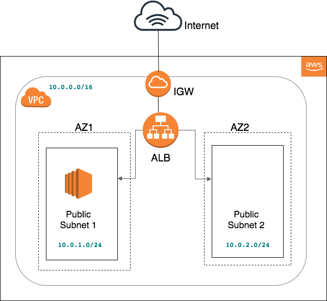

### Automating AWS Infrastructure (ec2 + load balancer) using python Boto3

#
As mentioned in coding exercise, the **createWebInfra.py** script when executed will create **AWS Infrastructure** with **load balancer and ec2 instance created with nginx server**
The following script can be written in modular approach as best coding practice

Application created and available at:  http://elbhelloservice-1649805918.ca-central-1.elb.amazonaws.com/

# Architecture 

# Workflow

1. Created **ClientFinder** class as base and child class **AWSClient** using inheritance
2. Created EC2 class with common functionalities from Boto3 module for EC2 client
3. Created VPC class with common functionalities from Boto3 module for EC2 client for creating VPC
4. Using Main module, from where the execution starts with default variables
5. Any error thrown will be caught using boto3 exceptions module and default Exceptions
6. if error thrown, then it will delete the AWS infrastructions step by step taking dependencies into consideration

# Execution steps

1. Used Pycharm and added **aws_access_key_id** and **aws_secret_access_key** 
   in **~/.aws/credentials** with region ca-central-1 using aws cli
1. Run command **chmod u+x createWebInfra.py**
2. Navigate to AutomateInfrastructure folder and run **./createWebInfra.py**

# Materials

1. https://boto3.amazonaws.com/v1/documentation/api/latest/reference/services/ec2.html#client

2. https://boto3.amazonaws.com/v1/documentation/api/latest/reference/services/ec2.html#waiters

3. https://boto3.amazonaws.com/v1/documentation/api/latest/reference/services/elbv2.html#client

# Blog

https://blog.arunprabhu.tech/2020/08/automating-aws-infrastructure-ec2-load.html